— 🔭 AI-assisted math grading systems (OCR × LLM)
- 🌱 OCR pipelines & LLM-based agents
- 👯 AI + Education, intelligent assessment tools
- 🤔 Handwritten math OCR & system scaling
- 💬 Math olympiads, math education, LaTeX, AI teaching tools
- 📫 Public Account (WeChat): LeyuDame

<!--
**YZDame/YZDame** is a ✨ _special_ ✨ repository because its `README.md` (this file) appears on your GitHub profile.

Here are some ideas to get you started:

- 🔭 I’m currently working on ...
- 🌱 I’m currently learning ...
- 👯 I’m looking to collaborate on ...
- 🤔 I’m looking for help with ...
- 💬 Ask me about ...
- 📫 How to reach me: ...
- 😄 Pronouns: ...
- ⚡ Fun fact: ...
-->
